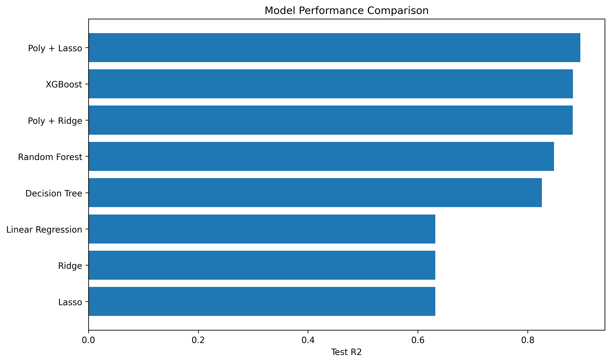
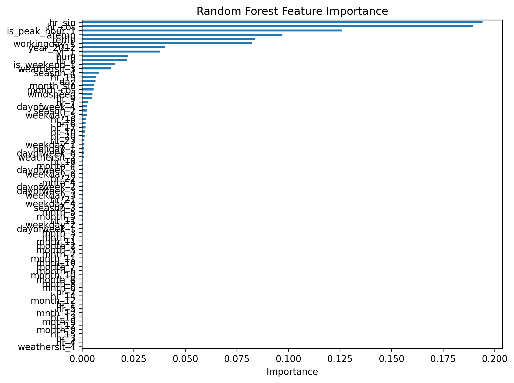
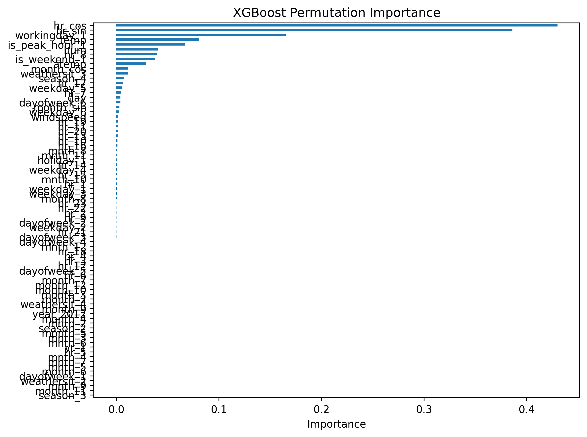
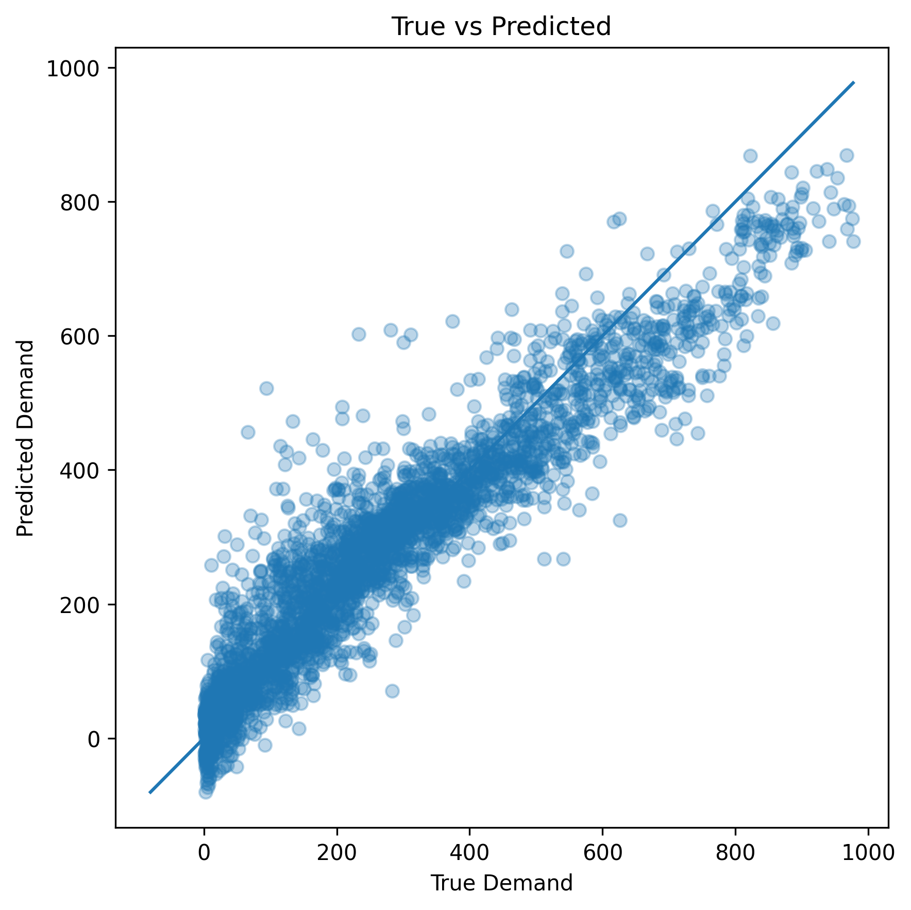
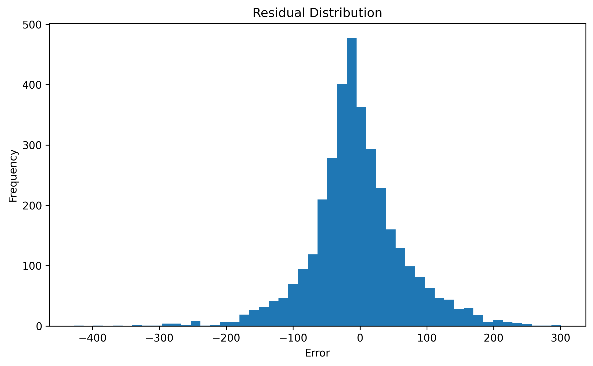

# Bike Sharing Demand Prediction

This project is an end-to-end machine learning regression project for predicting bike sharing demand.
It is based on the **UCI Bike Sharing Dataset** and focuses on data preprocessing, feature engineering, model comparison, hyperparameter tuning, model evaluation, and result visualization.

## Project Overview

Bike sharing demand is affected by multiple factors, including time, weather, season, temperature, humidity, holidays, and working days.
The goal of this project is to build a complete machine learning pipeline that predicts the total number of bike rentals based on historical usage and environmental features.

This project covers the full workflow of a regression task:

- Data loading and basic data inspection
- Date and time feature engineering
- Leakage-aware feature selection
- Time-based train-test split
- Model training and comparison
- Hyperparameter tuning
- Model evaluation
- Feature importance analysis
- Result visualization
- GitHub-ready project packaging

## Project Highlights

- Compared 8 regression models:
  - Linear Regression
  - Decision Tree Regressor
  - Ridge Regression
  - Lasso Regression
  - Polynomial Ridge Regression
  - Polynomial Lasso Regression
  - Random Forest Regressor
  - XGBoost Regressor
- Applied `GridSearchCV` and `RandomizedSearchCV` for hyperparameter tuning.
- Used `TimeSeriesSplit` during cross-validation to better match the time-dependent nature of bike demand data.
- Evaluated models using `R2`, `MAE`, `MSE`, `RMSE`, and train-test performance gap.
- Removed `casual` and `registered` from the feature set to avoid data leakage, because `cnt = casual + registered`.
- Saved model results, tuning summaries, feature importance results, and visualization images for direct GitHub presentation.
- Used feature importance and permutation importance to interpret model behavior.

## Dataset

The dataset used in this project is the **Bike Sharing Dataset** from the UCI Machine Learning Repository.

Dataset link:  
https://archive.ics.uci.edu/dataset/275/bike+sharing+dataset

### Main Features

The dataset includes time-related, weather-related, and usage-related features:

- `instant`: record index
- `dteday`: date
- `season`: season
- `yr`: year
- `mnth`: month
- `hr`: hour
- `holiday`: whether the day is a holiday
- `weekday`: day of the week
- `workingday`: whether the day is a working day
- `weathersit`: weather condition
- `temp`: normalized temperature
- `atemp`: normalized feeling temperature
- `hum`: normalized humidity
- `windspeed`: normalized wind speed
- `casual`: count of casual users
- `registered`: count of registered users

### Target Variable

- `cnt`: total number of bike rentals

### Data Leakage Notice

The original dataset contains `casual`, `registered`, and `cnt`.
Since `cnt = casual + registered`, using `casual` and `registered` as input features would leak target information into the model.
Therefore, this project removes both `casual` and `registered` from the feature set before training.

## Project Structure

```text
bike-sharing-demand-prediction/
│
├── data/
│   ├── day.csv
│   ├── hour.csv
│   └── Readme.txt
│
├── notebook/
│
├── result/
│   ├── model_results.csv
│   ├── tuning_summary.csv
│   ├── rf_feature_importance.csv
│   ├── xgb_permutation_importance.csv
│   ├── model_comparison.png
│   ├── rf_feature_importance.png
│   ├── xgb_permutation_importance.png
│   ├── true_vs_predicted.png
│   └── residual_distribution.png
│
├── src/
│   ├── data_loader.py
│   ├── evaluate.py
│   ├── model.py
│   └── visualize.py
│
├── .gitignore
├── main.py
├── requirements.txt
└── README.md
```

## Models Used

This project compares both linear and non-linear regression models.

| Model | Purpose |
|---|---|
| Linear Regression | Baseline linear model |
| Ridge Regression | Linear model with L2 regularization |
| Lasso Regression | Linear model with L1 regularization |
| Polynomial Ridge | Captures non-linear relationships with L2 regularization |
| Polynomial Lasso | Captures non-linear relationships with L1 regularization |
| Decision Tree Regressor | Non-linear tree-based model |
| Random Forest Regressor | Ensemble model based on bagging |
| XGBoost Regressor | Boosting-based ensemble model |

## Evaluation Metrics

The following metrics are used to evaluate model performance:

- `R2`: Measures how well the model explains the variance of the target variable.
- `MAE`: Mean Absolute Error, showing the average absolute prediction error.
- `MSE`: Mean Squared Error, giving larger penalties to large errors.
- `RMSE`: Root Mean Squared Error, which is easier to interpret than MSE.
- `Gap`: Difference between training R2 and testing R2, used to observe overfitting.

## How to Run

First, install the required dependencies:

```bash
pip install -r requirements.txt
```

Then run the main program:

```bash
python main.py
```

## Output Files

After running the program, the following files will be generated in the `result/` directory:

```text
model_results.csv
tuning_summary.csv
rf_feature_importance.csv
xgb_permutation_importance.csv
model_comparison.png
rf_feature_importance.png
xgb_permutation_importance.png
true_vs_predicted.png
residual_distribution.png
```

## Result Visualization

After running `python main.py`, the following charts can be viewed in the `result/` directory.

### Model Comparison



### Random Forest Feature Importance



### XGBoost Permutation Importance



### True vs Predicted



### Residual Distribution



## What I Learned

Through this project, I practiced:

- Building a complete regression machine learning workflow
- Handling time-related tabular data
- Avoiding target leakage in supervised learning
- Comparing different types of regression models
- Using cross-validation and hyperparameter tuning
- Evaluating model generalization with multiple metrics
- Interpreting model behavior through feature importance analysis
- Organizing a machine learning project into a GitHub-ready structure

## Future Improvements

Possible future improvements include:

- Adding more advanced feature engineering for time-based variables
- Comparing more boosting models such as LightGBM and CatBoost
- Adding model saving and loading functionality
- Building a simple prediction interface
- Adding a notebook version for step-by-step explanation
